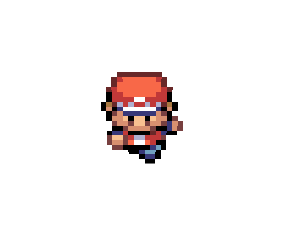
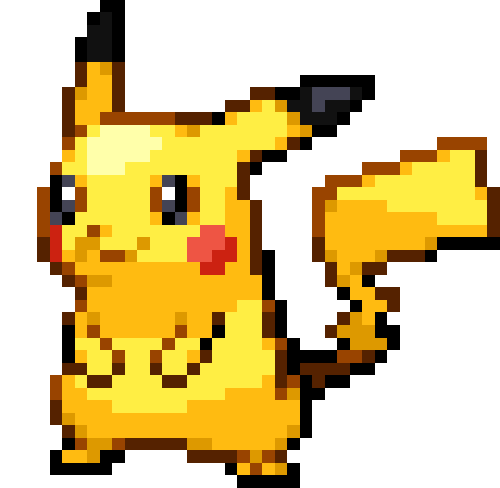

<a href="index.html">HOME</a>
<a href="portfolio.html">PORTFOLIO</a>
<a href="upperdivs.html">UPPER DIVS</a>

WELCOME

"I want to take everything I learn, each day, and put it to use."
 
Pokémon Journeys Episode 147

