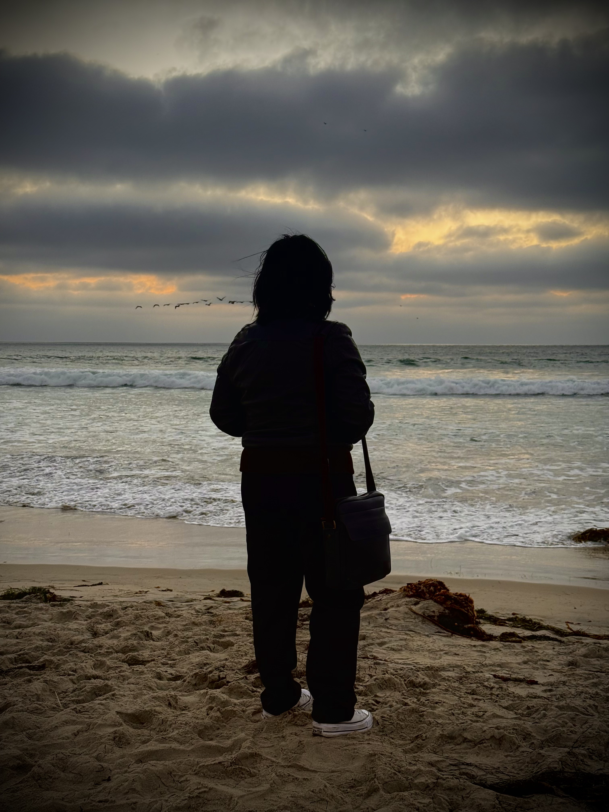

<a href="index.html">HOME</a>
<a href="portfolio.html">PORTFOLIO</a>
<a href="upperdivs.html">UPPER DIVS</a>

<!-- PHOTO SECTION -->

Kristine Santos

Undergraduate Biology Student

University of California, Riverside

<!-- BIO SECTION -->

Hi! My name is Kristine Santos and I am an undergraduate Biology student at the University of California, Riverside. My academic interests center around ecology, organismal biology, and the ways we can use both field observations and data analysis to better understand the natural world.

Throughout my studies I have been especially drawn to courses that connect classroom knowledge with real-world experiences. Field-based classes have allowed me to observe organisms directly in their environments, while computational coursework has helped me develop skills in analyzing biological data and communicating scientific results.

Outside of coursework, I enjoy combining science with creativity. Whether it is through music, art, or building projects like this website, I like exploring different ways to share what I learn and express curiosity about the world around me.

This website serves as a small portfolio of my academic experiences, interests, and projects during my time studying biology.

