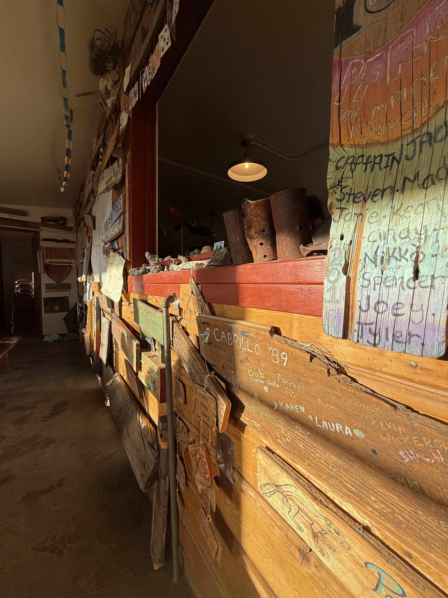
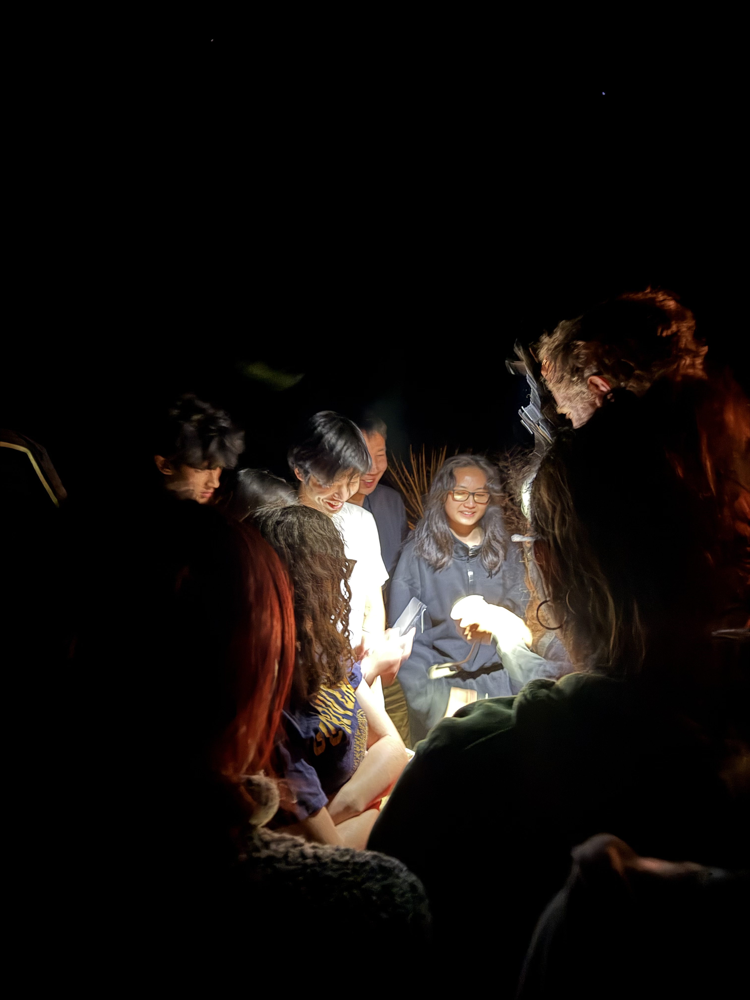
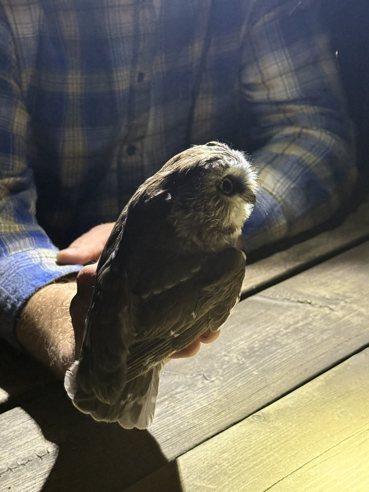
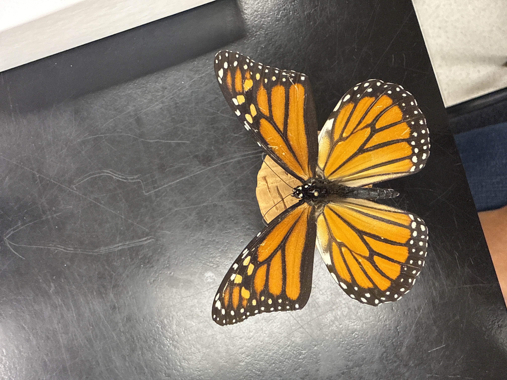
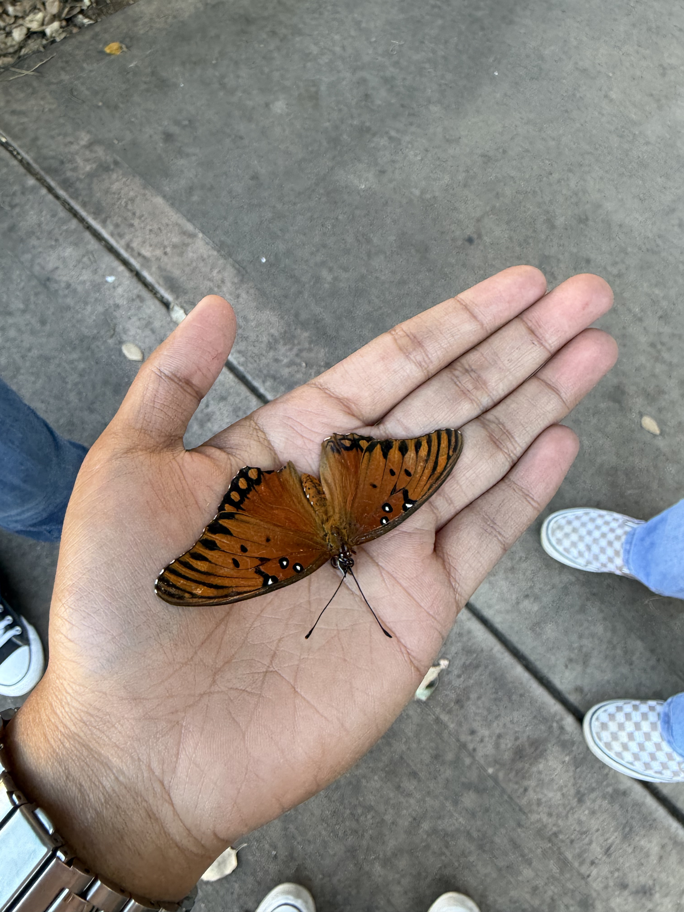
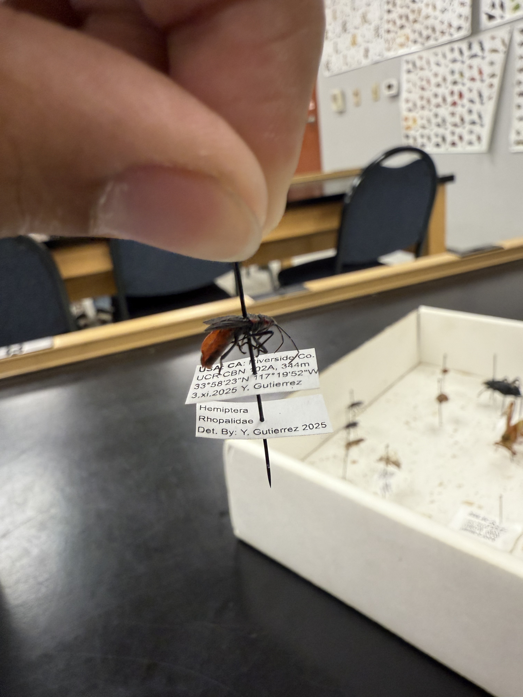

<a href="index.html">HOME</a>
<a href="portfolio.html">PORTFOLIO</a>
<a href="upperdivs.html">UPPER DIVS</a>

<h1>Upper Division Coursework</h1>

One of the most exciting parts of studying biology is getting to see how the ideas we learn in lecture actually appear in the real world. Many of my upper division classes combine traditional lectures with hands-on experiences, field observations, and opportunities to interact directly with organisms in their natural environments.

Courses like BIOL 101 focus on developing computational skills that allow biologists to analyze datasets, visualize patterns, and communicate results clearly.

<h2>BIOL 101 – Computational Biology and Data Skills</h2>

BIOL 101 focuses on developing computational and data analysis skills that are increasingly important in modern biology. In this course we used tools such as R and Quarto to organize biological datasets, create visualizations, and interpret results from scientific studies.

Through projects in this class I learned how coding can support scientific workflows by helping researchers analyze data, generate figures, and present results clearly.

<a href="Kristine-Santos-Unit-3-Project.html" target="_blank">
View My BIOL 101 Website Project
</a>

<h2>BIOL 163 – Vertebrate Natural History</h2>

Vertebrate Natural History explores how vertebrates behave and survive in their natural environments. In lecture we studied vertebrate morphology, evolutionary relationships, and how anatomical traits help animals adapt to different habitats.

A highlight of the course was participating in overnight field trips to the Mojave Desert and the James Reserve in Idyllwild. During nighttime surveys we searched for vertebrates that are most active after dark.

These field experiences allowed us to observe animals such as owls and snakes and connect the anatomy we studied in lecture with how those traits help animals survive in the wild.

❮

❯

<h2>ENTM 100 – General Entomology</h2>

General Entomology explores the incredible diversity of insects and how scientists study them. In this course we learned about insect anatomy, classification, and evolutionary relationships.

One of the most exciting parts of the class was building our own insect collections. Searching for insects in different habitats honestly felt a lot like catching Pokémon — except instead of Pokéballs we used nets and specimen boxes.

Each insect was preserved, labeled with collection data, and identified using morphological traits such as wing patterns, antennae, and body segmentation.

❮

❯

<h2>BPSC 104 – Plant Diversity</h2>

Plant Diversity focuses on the evolutionary history and classification of plants. By studying plant morphology including reproductive structures, vascular systems, and leaf organization we learned how botanists distinguish between plant groups and trace their evolutionary history.

Looking at plants through this perspective changes the way you see them in everyday life. Instead of simply seeing plants as part of the landscape, you begin to recognize the structures and adaptations that reveal their ecological roles and evolutionary relationships.

